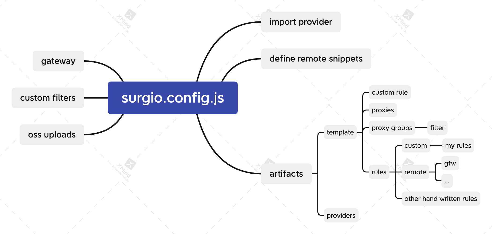

# Stardust科学上网Clash脚本生成器

**名词定义**
- 脚本：clash使用的脚本，即.yaml文件
- 模板：本工具使用生成脚本的模板，即.tpl文件
- 规则：clash科学上网的规则

**文件结构**

- surgio.conf.js：主模板文件
    - remoteSnippets：定义了远程规则，其中gfwlist为我们自己维护
    - artifacts：定了生成的模板文件
    - upload：定义了上传方式
    - gateway：定义了远程部署方式
- provider: 保存了我们的几个梯子源
    - hitun: https://hitun.io/ 购买的梯子
    - stardust: 我们自己部署的梯子
- template：模板文件，用于生成最后的clash脚本
    - snippet：规则集
        - my_rules：自定义规则
        - 其他：网友自定义规则
    - clash.tpl：脚本模版
        - 配置逻辑：按区域分梯子，每隔一定时间测速，最后使用“自动选择”来选择最快的区域的梯子
        - 效果：全自动配置，无需手动

**使用方式**
- 首先需要在翻墙环境才可以下载remote snippets
- 使用`sh run_update.sh`，完成整个步骤
- 更新脚本：`npx surgio generate`，生成的模板会保存在“dist”文件夹里
- 上传至OSS：`npx surgio upload`，模板会上传至制定位置
- 部署至云端：`npx vercel --prod`，具体见[文档](https://surgio.js.org/guide/advance/api-gateway.html#%E9%83%A8%E7%BD%B2-vercel)
    

# 环境变量
> 注意: 以下环境变量仅供调试使用

- SURGIO_NETWORK_TIMEOUT
    - 默认值: 5000 单位: 秒
- SURGIO_NETWORK_RETRY
    - 默认值: 0
    - 举例，当最大重试次数为 2 时，加上原始的请求最多会请求 3 次。
- SURGIO_NETWORK_CONCURRENCY
    - 默认值: 5
- SURGIO_REMOTE_SNIPPET_CACHE_MAXAGE
    - 默认值: 43200000（12 小时）
- SURGIO_PROVIDER_CACHE_MAXAGE
    - 默认值: 600000（10 分钟）

# 其他
如果遇到本地文件缺失，可以使用`npm install surgio`或者`npm update`来更新本地文件